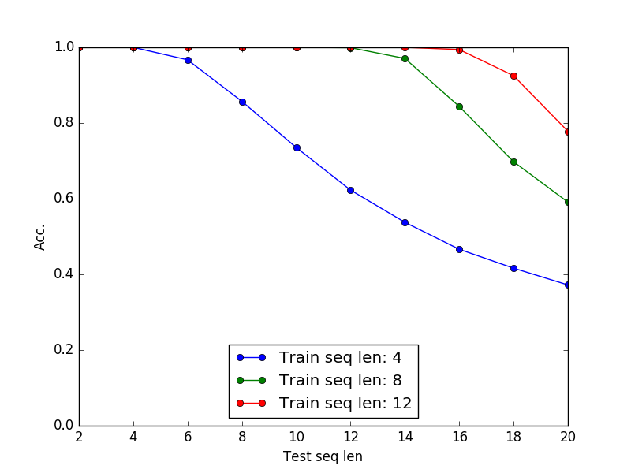
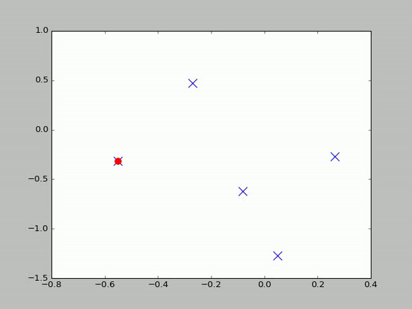

# attractors
A set of simulations on attractor models

**Reproducing Fast Weights results**

      cd repro_fw
      python retrieval.py gen_data           # cache datasets in ./data
      python retrieval.py lstm_vs_fw 8       # run experiment with sequence of length 8

This reproduces the results in section 4.1 of the paper with 30 hidden units (you can change parameters [here](https://github.com/PCJohn/attractors/blob/e1435ea0bd83a30f41cb22d8cb27992cfb83fd39/repro_fw/retrieval.py#L13)). 

Training in practice: 1. Layer normalization helps a lot particularly if you have different gains, biases for every inner loop iterations. 2. You can use an aggressive learning rate and explicitly drop it after some iterations.

**Robustness to noise** 

Add noise to the query (last element in the sequence) and track test accuracy.

     python noise.py

Results with sequence lengths 4 and 8. The drop in accuracy is less if the sequence is short, as it needs to save fewer memories. The LSTM model is really sensitive to noise (not too impressive, but something you get right off the bat).

      
      

**Test on longer sequences**

Train on a short sequence and test on longer sequences

**Hopfield nets with discrete states**

