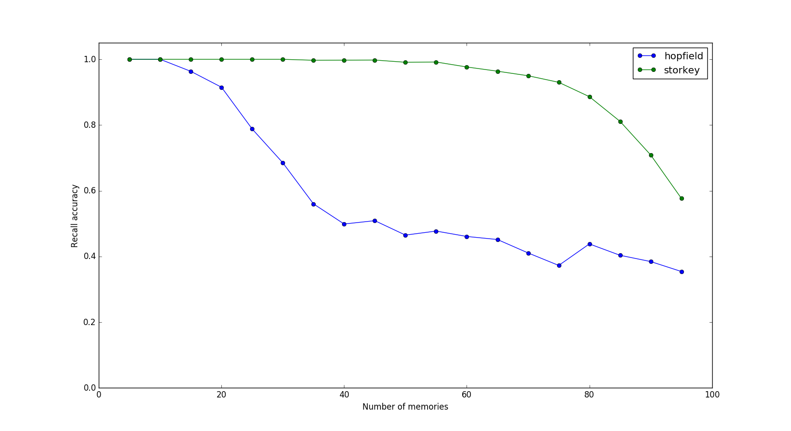
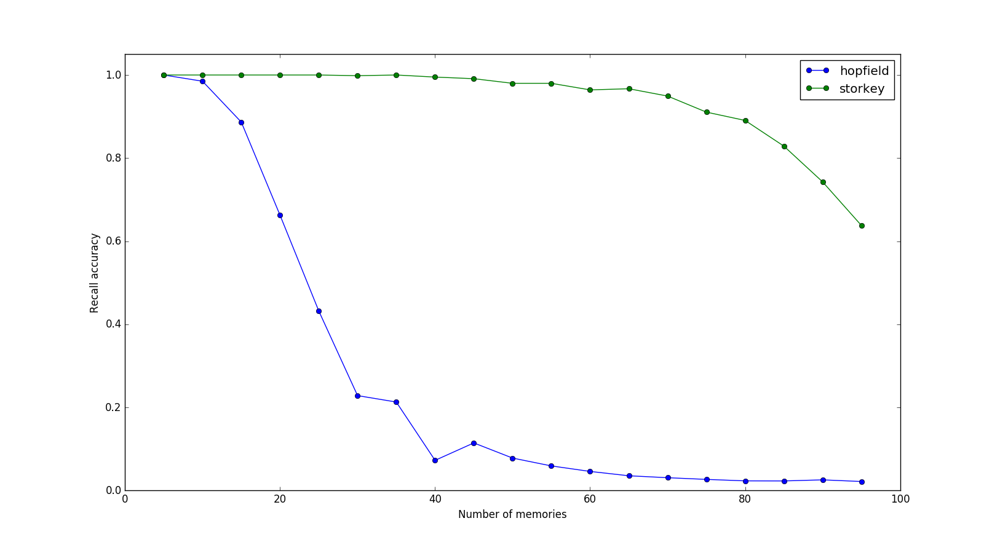
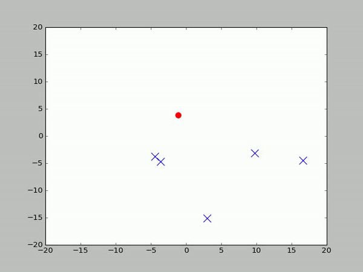
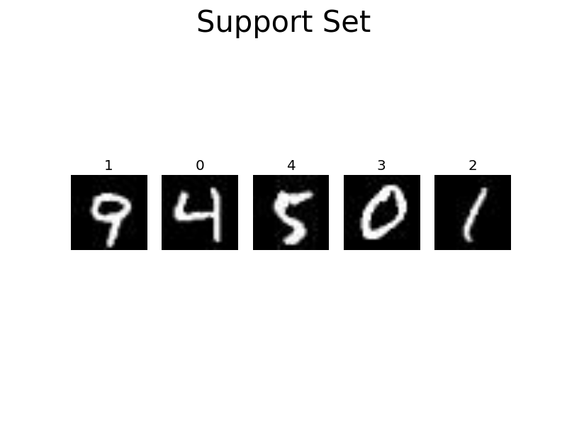
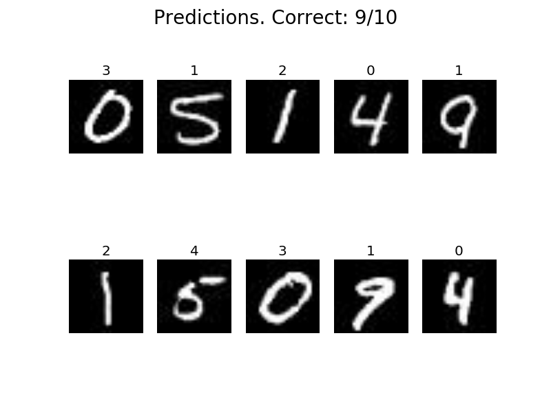

# Attractors
A set of simulations on attractor models for memory

**1. Standard Hopfield Nets**

**Hopfield update rules:**
Compare storage capacity of Hopfield nets with different update rules. Insert random vectors into a net with 100 units and track recall accuracy. The Storkey update rule gives more capacity with unbiased vectors. It also does much better when the patterns are correlated. The outer product rule has an accuracy drop after 0.14N.

Plot on the left: unbiased memory vectors (+1 or -1 with probability 0.5)

Plot on the right: correlated memory vectors (+1 or -1 with probability 0.4 and 0.6)

      cd hopfield
      python hopfield.py update_rule

      
      

**Hopfield nets with discrete states:**
A standard Hopfield model pushes states towards attractors. Once in a basin, the state is stable and doesn't move around (gif on the left). Following section 5.2 in the [World of Attractor Neural Networks](https://www.amazon.com/Modeling-Brain-Function-Attractor-Networks/dp/0521421241), we can add cross-terms to the weight matrix to make the state hop around over attractors (gif on the right). This lets us store sequences of discrete symbols.

      cd hopfield
      python hopfield.py lookup     # standard hopfield memory lookup
      python hopfield.py sequence   # hopfield net hopping over discrete states

      
      

**2. Reproducing [Fast Weights](https://arxiv.org/pdf/1610.06258.pdf) results**

      cd repro_fw
      python retrieval.py gen_data           # cache datasets in ./data
      python retrieval.py lstm_vs_fw 8       # run experiment with sequence of length 8

This reproduces the results in section 4.1 of the paper with 30 hidden units (you can change parameters [here](https://github.com/PCJohn/attractors/blob/e1435ea0bd83a30f41cb22d8cb27992cfb83fd39/repro_fw/retrieval.py#L13)). 

Training in practice: 1. Layer normalization helps a lot particularly if you have different gains, biases for every inner loop iterations. 2. You can use an aggressive learning rate and explicitly drop it after some iterations. 3. Training is much faster using onehot vectors instead of learned embeddings (this isn't surprising as the associative memory generally works better with sparse vectors).

**Robustness to random noise:**
Add noise to the query (last element in the sequence) and track test accuracy.

     python noise.py

Results with sequence lengths 4 and 8. The drop in accuracy is less if the sequence is short, as it needs to save fewer memories. The LSTM model is really sensitive to noise (not great, but something you get right off the bat).

      
      

**3. Few Shot Learning with Memory**

We can use the memory module to store the features of the support set. This is similar to [Kaiser et al](https://arxiv.org/pdf/1703.03129.pdf), but with an attractor net as the memory module. 

      cd fewshot
      sh omniglot.sh
      
This will train 5-way, 1-shot models on Omniglot, with and without a memory model and test them on 1000 novel meta tasks. 

  | Without memory | With memory  |
  |----------------|--------------|
  |  0.907 ± 0.11  | 0.981 ± 0.04 |

These results are close to what is reported in Kaiser et al, but give us the computational efficiency of using attractors instead of nearest neighbours.

We can also run a nice demo on similar, but different dataset (MNIST) to confirm we're learning something sensible.

      python demo.py
      
This will use the saved model with memory and display a sample support set along with the test samples and predictions.

      
      

