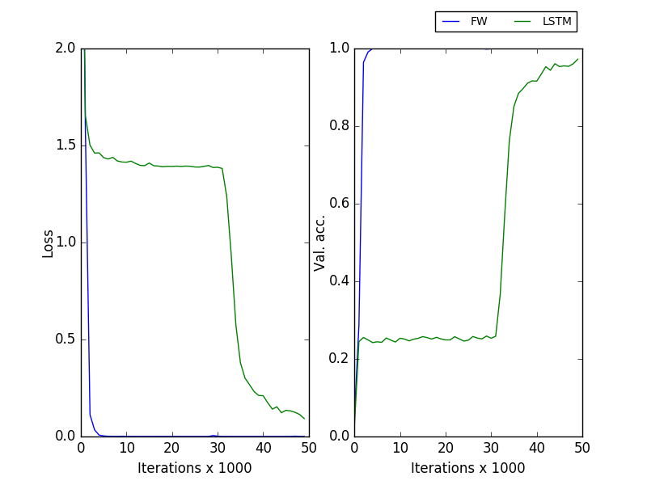

# attractors
A set of simulations on attractor models

**Reproducing Fast Weights results**

      cd repro_fw
      python retrieval.py gen_data           # cache datasets in ./data
      python retrieval.py lstm_vs_fw 8       # run experiment with sequence of length 8

This reproduces the results in section 4.1 of the paper with 30 hidden units (you can change parameters [here](https://github.com/PCJohn/attractors/blob/e1435ea0bd83a30f41cb22d8cb27992cfb83fd39/repro_fw/retrieval.py#L13)). 

Training in practice: 1. Layer normalization helps a lot particularly if you have different gains, biases for every inner loop iterations. 2. You can use an aggressive learning rate and explicitly drop it after some iterations.

**Robustness to noise:** Add noise to the query (last element in the sequence) and track test accuracy.

     python noise.py

      
      

